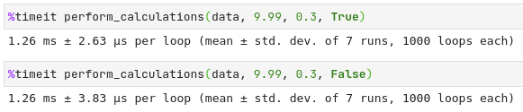

# Analytical task for INT20H 2020

**Xterm-inate** team

---

## Task Description

Creat a console application for calculating LTV from input data.

**User flow** is next:

0. Trial
1. First purchase
2. Second purchase
3. N-th purchase

User makes subscription for every week and user can unsubscribe in any moment and he will not pay anymore.

Apple store takes **30% fee** from each purchase in application.

Application **price** is $9.99.

## Task Solution

The first of all, taking in account user flow, we will have (N - 1) "rolling" (kinda) retention values: from trial to first purchase, from first purchase to second purchase and so on.

From all the data we will need only 2 columns. The first one is `Subscriber ID`, the second one is `Event Date`. We can drop all other columns \`cause in provided dataset all other columns are not informative for this task.

We can calculate LTV from this data using 2 different approaches:

1. Using retention.
2. Using average lifetime money spent (method is taken from [here](https://www.thebalancesmb.com/how-to-calculate-the-lifetime-value-of-a-customer-4173824)).

For both methods we will need an array of users renewing the subscription for each week (from 0-'trial' to N-1) and for the second method we will additionaly use an array of weeks from 0 to N-1.

To get this data we simply do some pandas grouping and aggregation stuff.

The first grouping is done by `Subscriber ID` with `count` aggregation. This will tell us how many weeks each individual user was interesated in buying our application.

The second grouping is done by `Event Date` (which is count of user weeks now) with `count` aggregation. This will give us information about how many users bought our application in every week.

Using this two groupings we will have a dataset where index is the week number and single column represents users who renewed their subscription after week 1.

<details><summary>Code for this operation</summary>

Thank you for opening this spoiler. I thought it will never be opened. Groupings stuff is here.

```python
data = (data
        .groupby(by="Subscriber ID").count()
        .reset_index()
        .groupby(by="Event Date").count()
        .sort_index()
        )["Subscriber ID"]
weeks, user_counts = data.index.values - 1, data.values
```

</details>

### Using Retention

The first of all we must mention that (just for now) we did not took into account users week-N users into week-(N-1)...week-0 users, so we must fix it.

The first of all we revert the users array so that we have users in order week-N to week-0, ant take cumulative sum. With that trick we users from week-N will sum to users from week-(N-1), week-(N-2) and so on. Now we only need wo revert the list backwards.

<details><summary>Code for this operation</summary>

Hey, you are back! Nice to meet you... Again. We are counting users by weeks here, come to see it.

```python
users = user_counts[::-1].cumsum()[::-1]
```

</details>

To calculate rolling retention we should divide users from week-N to week-(N-1). To do that we just shift our list to left and divide it by itself original.

<details><summary>Code for this operation</summary>

Wow, you opened it. Very impressive. Just simple shift and division code here. ~~Why I have created a spoiler for it?~~

```python
users[1:] / users[0:-1]
```

</details>

Next part is just cumulative production of all the elements in the list and multiplying it by `price * (1 - fee)`.

### Using Average Lifetime Money Spent

This is quite easy. We do not have users who pay in week-0, so we just multiply week numbers by number of users who payed and multiply it by `price * (1 - fee)`. We will get distribution of money spent by users depending on how long do they use our app. The next step is just sum and division by the number of users.

## Application Usage

The first of all to start using it you must install Python 3. You can find it [here](https://www.python.org/downloads/).

The next step is installing additional libraries to use this app. This can be done running next command from command line ~~(hope you are using Linux, omg)~~.

```bash
pip install -r requirements.txt
```

And only now we got to the step where you use our app.

To get help how to run it you can use:

```bash
python ltv.py -h
```

This will give you all parameters description and show example on how to run it.

To run program with default parameters:

```bash
python ltv.py
```

The full application command is next(all parameters are optional):

```bash
python --path PATH/TO/FILE --price 10 --fee 0.1 --with-retention
```

To change path to file with data use `--path PATH/TO/FILE` parameter.

To change application price use `--price` parameter.

To change market fee `--fee` parameter.

To run application with retention calculations use `--use-retention` parameter.

## Timing

This stuff is freaking fast. Just look at it!



## Team Xterm-inate

- Vladyslav Zalevskyi (Tg: @vzalevskyi)
- Vladyslav Rudenko (Tg: @VVRud)
- Olga Pashneva (Tg: @DDR335)
- Olena Poliakova (Tg: @oradchykova)


